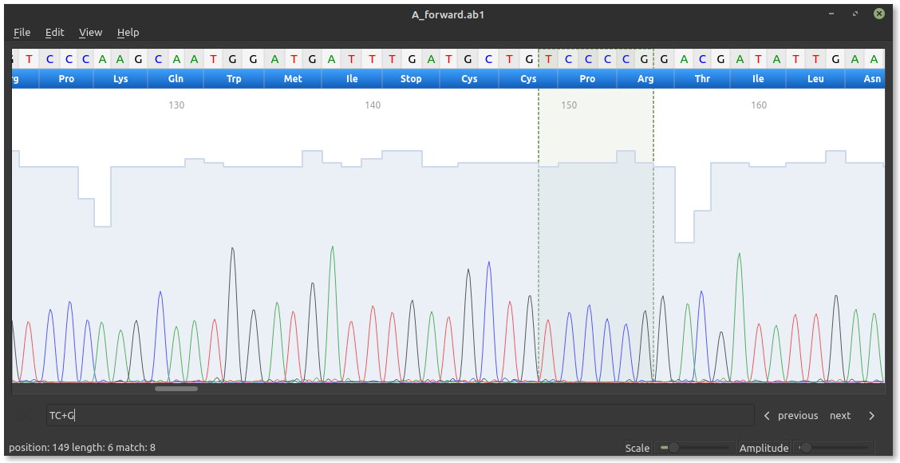

# Summary
CutePeaks is a standalone Sanger trace viewer steered by a modern and user-friendly UI. Unlike other software, CutePeaks comes with two new features: searching for a regular expression and exporting the traces to SVG.    
CutePeaks is available for Linux, macOS and Windows at [https://labsquare.github.io/CutePeaks/](https://labsquare.github.io/CutePeaks/).

# Statement of need
Despite the major use of next generation sequencing, the Sanger method is still widely used in genetic labs as the gold standard to read target DNA sequences. Very few open source software is available to explore Sanger trace data and most of labs staff still rely on proprietary software. Moreover, they are not always user-friendly and lack modern look and feel. 

# State of fields
4peaks [@4Peaks] is software widely used by biologists that benefits from a nice user interface. Sadly, it is only available on macOS and source code is not open to community enhancement. Seqtrace [@seqtrace] is the only standalone and open source application we could find. However, it is written with the GTK framework in Python 2, the latter being deprecated and slower than C++. 

# Software overview

CutePeaks is a cross-platform application implemented in C++ using the open source Qt5 framework. It can read FSA and ABIF file formats, and display the chromatogram with standard controllers.
The chromatogram is displayed in an interactive window allowing the user to move along the trace. It can also re-scale the plot dynamically using two slider controllers. Finger gestures are also available for scrolling upon using a touch screen.
Similarly to 4peaks software [@4Peaks], Phred quality scores are displayed behind the trace as a blue histogram. Base calling is displayed at the top of the viewing window, along with adjustable amino-acid translation.
The trace can be used as with a text editor. Navigating along the trace, copying the sequence to the clipboard or cutting it is done using standard keyboard shortcuts. Revert/complement is also possible.
An original feature of CutePeaks is the possibility to search for a sequence in the trace using a regular expression. This is especially useful to search for a sequence pattern. For example, the query A[CG]T will search for all instances of ACT or AGT. The query AC+T will select all instances of the form ACT, ACCT, ACCCCT, etc. Finally, the trace data can be exported to different formats, such as FASTA or SVG image, the latter being particularly useful for resolution-independent illustration.

# Installation

CutePeaks is hosted on the GitHub development platform. Continuous integration is provided by GitHub Actions.
For Linux, an AppImage is provided, that is, distribution agnostic and runs out of the box.
For Windows, a 32 bits binary compiled with mingw is provided and can be executed as a standalone application without administrator privileges. For macOS, a disk image is provided.

# Acknowledgements

We acknowledge contributions from Jérémie Roquet, and Francisco Pina-Martins.

# References
